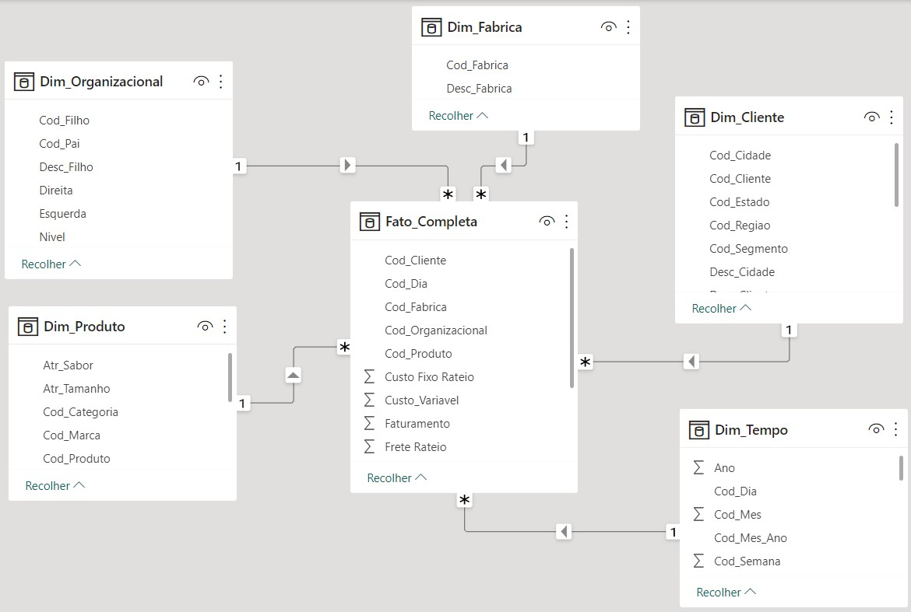
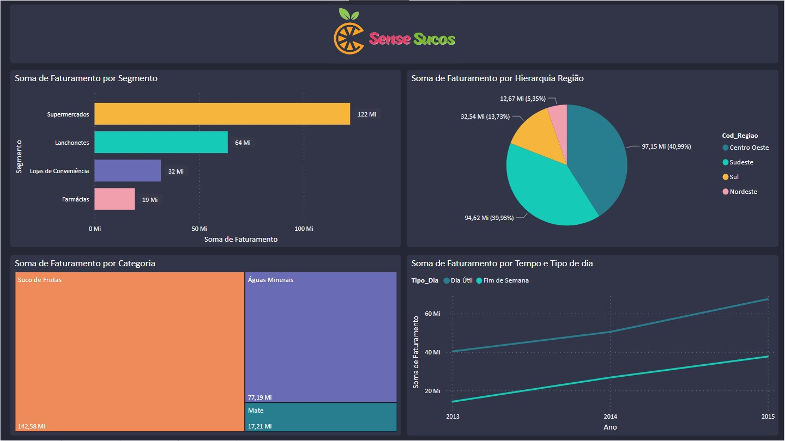
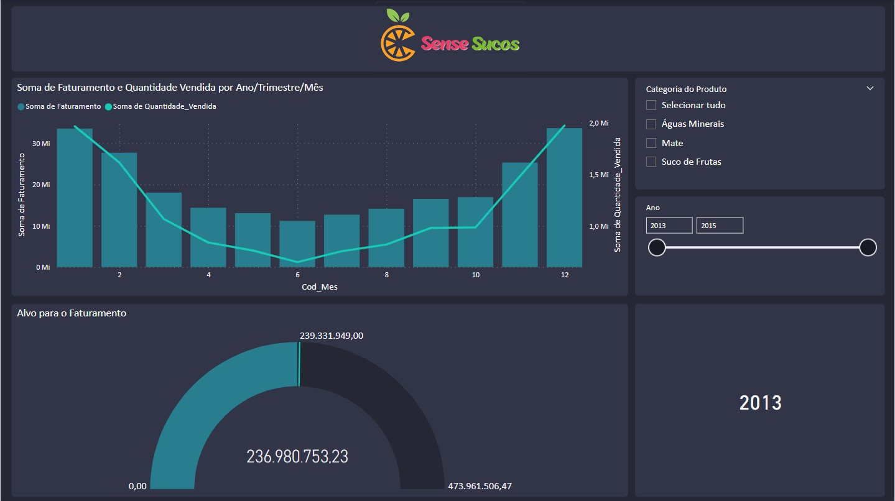
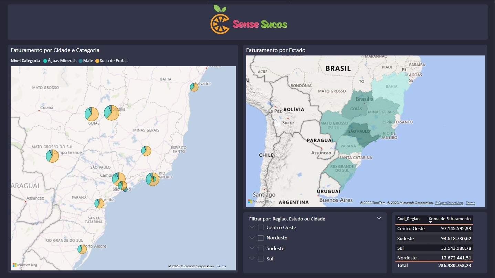
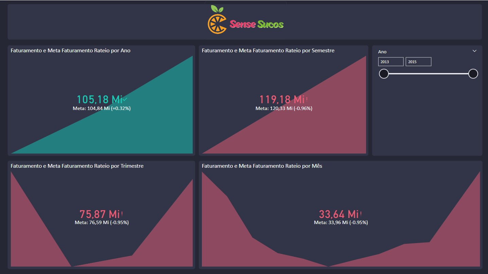
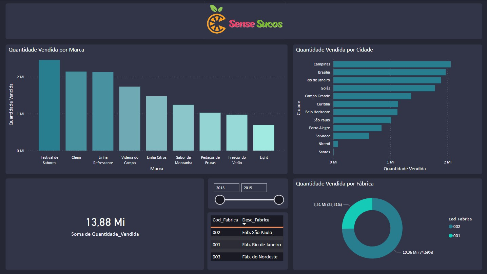

  <h1> 📊 Projeto de Sistemas de Apoio a Decisão (SAD) - UFCG</h1>

## 📑 Sumário

- [Sobre](#about)
- [Modelo de Dados](#model)
- [Resultado](#result)
- [Tecnologias](#tecs)
- [Autores](#authors)
- [Licença](#license)

## 📝 Sobre 

Projeto voltado a construção de uma solução de BI usando a tecnologia Microsoft SQL Server e
Microsoft Power BI

Para mais detalhes sobre o projeto, acesse [SAD 2022.1 - Projeto BI](docs/SAD%202022.1%20-%20%20Projeto%20BI.pdf)

## 🎲 Modelo de Dados 

➡️ O arquivo de dados utilizado encontra-se em `datasets/DW_SUCOS.BAK`, para acessá-lo clique [aqui](datasets/DW_SUCOS.BAK).

## ✅ Resultado 

## 🚀 Tecnologias 

- [SQL Server](https://www.microsoft.com/pt-br/sql-server/) - Banco de dados relacional.
- [Power BI](https://powerbi.microsoft.com/pt-br/) - Ferramenta de visualização de dados.

## 🔰 Autores: 

- [@pedro-manoel](https://github.com/pedro-manoel)
- [@emannuellymelo](https://github.com/emannuellymelo)
- [@izabellaribeiro](https://github.com/izabellaribeiro)
- [@jpedrosml](https://github.com/jpedrosml)
- [@marianasn](https://github.com/marianasn)

## 📃 Licença 

Esse projeto está sob a licença MIT. Veja o arquivo [LICENSE](LICENSE) para mais detalhes.
